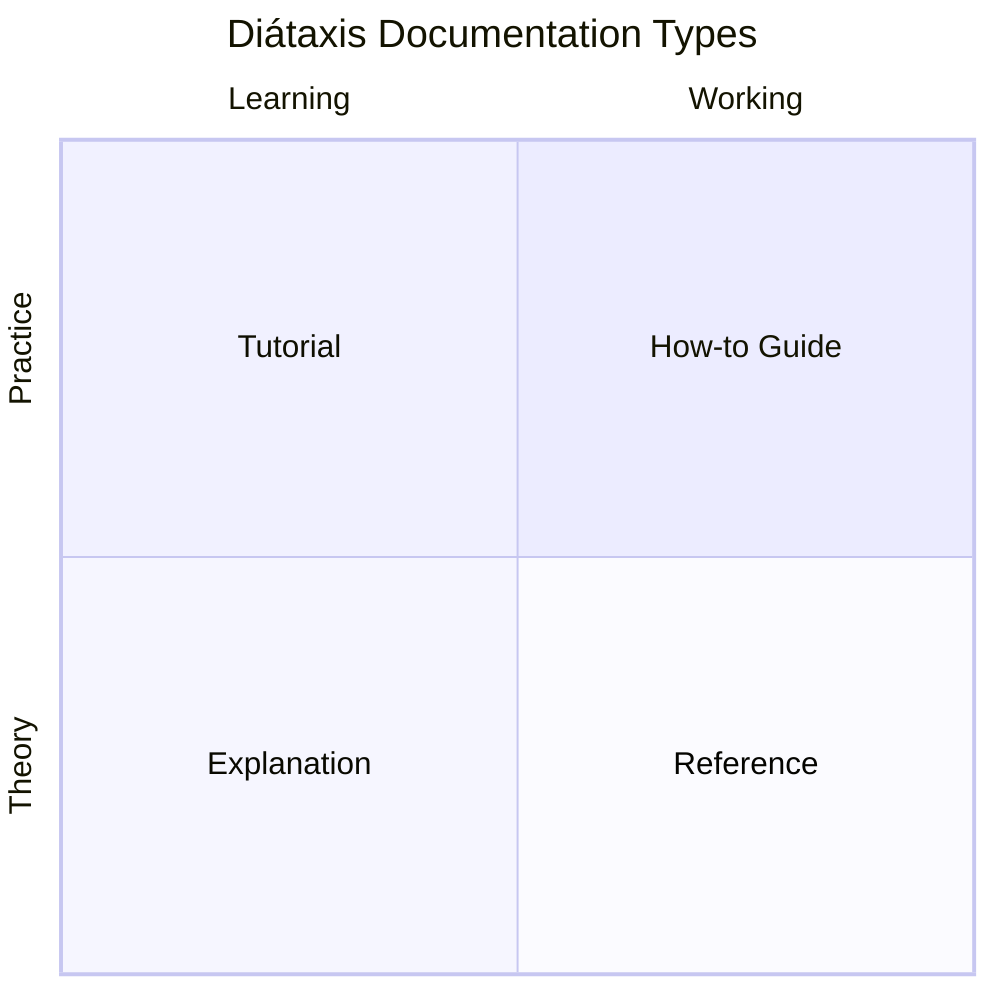
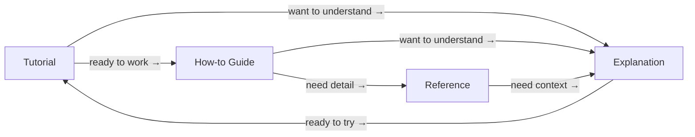

# Diátaxis Framework

[Diátaxis](https://diataxis.fr/) organizes user-facing documentation into four types based on two axes: theory vs. practice, and learning vs. working.

## How the types link together

The four types are complementary, not competing. A reader who finishes a Tutorial should know where to find How-to Guides for everyday tasks, Reference for lookup, and Explanation when they want to go deeper.

Cross-link freely between types. A Tutorial can say "for all options, see the [Reference](...)". A How-to Guide can say "to understand why, see [Explanation](...)". The page itself stays in its lane — the links are how readers navigate between lanes.

## The Four Types

### Tutorial (learning + practical)

**Purpose:** Teach a concept through guided practice.

The author is responsible for the learner's success. A tutorial is a lesson — not a how-to guide.

- Teach by doing, not by explaining
- Follow a linear, repeatable sequence
- Provide only enough explanation to keep the learner moving
- Ensure the learner achieves a meaningful result
- Never let the learner fail silently

**Example:** "Build your first payment form" — walks the reader through every step from zero to a working result.

**What it's not:** A reference listing every option. A conceptual explanation of how payments work. A checklist for an experienced user.

**What it links to:** How-to Guides for follow-on tasks. Explanation if the reader wants to understand the concepts they just practiced.

### How-to Guide (working + practical)

**Purpose:** Help a competent user solve a specific problem.

Assumes the reader already understands the basics and has a concrete goal.

- Address a real-world problem in the title ("How to configure SSO")
- Be direct — steps, not lessons
- Show flexibility (alternative approaches, flags, options)
- Don't teach foundational concepts — link to tutorials or explanations instead

**Example:** "How to add webhook retries" — assumes the reader knows what webhooks are and just needs the steps.

**What it's not:** A tutorial that teaches the reader from scratch. A reference that exhaustively covers every option. A conceptual explanation of why the feature works.

**What it links to:** Reference for full option lists and parameter details. Explanation when the reader asks "why does this work this way?". Other How-to Guides for related tasks.

### Reference (working + theoretical)

**Purpose:** Provide complete, accurate technical descriptions.

Reference docs describe the machinery. They must be austere, consistent, and exhaustive.

- Describe every parameter, return value, error code
- Use consistent formatting across all entries
- Don't include tutorials or opinions
- Organize by the structure of the codebase or API, not by user tasks
- Keep examples minimal and focused on illustrating the interface

**Example:** "API reference: POST /v1/charges" — lists every field, type, constraint, and error.

**What it's not:** A guide to accomplishing a task. A conceptual overview. An opinionated recommendation.

**What it links to:** How-to Guides that show how to use the API for common tasks. Explanation for architectural context.

### Explanation (learning + theoretical)

**Purpose:** Build deeper understanding of concepts, design decisions, and trade-offs.

This is where "why" questions get answered. Explanation docs provide context that other types deliberately omit.

- Discuss alternatives, trade-offs, and history
- Connect concepts to each other
- Opinions and recommendations belong here
- Not tied to a specific task or procedure

**Example:** "How Stripe's idempotency works" — explains the design, not the API call.

**What it's not:** A procedure for doing something. A comprehensive reference. A tutorial with hands-on steps.

**What it links to:** Tutorials for readers who want to learn by doing after reading theory. Reference for the exact details of what's been explained.

## The Cardinal Rule

**Don't mix types.** Each page should primarily serve one user need. When you catch yourself writing a tutorial that turns into a reference, or a how-to guide that digresses into explanation — split it.

It's fine to link between types. A tutorial can say "for a full list of options, see the [reference](...)". A how-to guide can say "to understand why this works, see [explanation](...)". But the page itself should stay in its lane.

## Applying Diátaxis

Before writing a user-facing document, identify which type it is:

1. **Is the reader learning or working?** Learning → left column. Working → right column.
2. **Do they need to do something or understand something?** Doing → top row. Understanding → bottom row.

If the answer is "both" — you probably need two documents.
