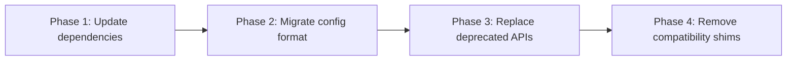

# Migration Guide

A migration guide helps users move from one version, system, or approach to another. The reader is in a vulnerable position — they have a working system and need to change it without breaking things.

## Principles

**Empathy first.** Migrations are stressful. The reader has a production system at stake. Be precise, be thorough, and never hand-wave through a step.

**Show the before and after.** For every change, show what the old version looked like and what the new version looks like. Don't make the reader guess.

**Test the path.** Walk through the migration yourself on a real (or realistic) system before publishing. Untested migration guides cause incidents.

## Sections

### Title (essential)

Be specific about the versions or systems involved: "Migrate from v2 to v3" or "Migrate from REST API to GraphQL".

### Overview (essential)

In 2-3 sentences, state:

- What is changing
- Why it's changing (link to the ADR or RFC if one exists)
- How long the migration typically takes

### Breaking changes (essential)

List every breaking change with a clear before/after comparison. This is the section readers check first.

Use a consistent format:

````markdown
#### Renamed `getUser()` to `fetchUser()`

**Before:**
```javascript
const user = client.getUser(id);
```

**After:**
```javascript
const user = client.fetchUser(id);
```
````

### Prerequisites (essential)

What must be true before the migration starts? Minimum versions, required access, backups to take.

### Step-by-step migration (essential)

Numbered steps, each producing a verifiable result. For each step:

1. State the action
2. Show the code or configuration change
3. Show how to verify it worked

**Group related changes** into phases. Between phases, the system should be in a working state. This lets users migrate incrementally rather than all-at-once.



### Rollback plan (recommended)

How to undo the migration if something goes wrong. Be specific — "revert the deploy" isn't a rollback plan.

### Deprecation timeline (recommended)

If old APIs or features are being sunset, state the timeline clearly:

| Feature           | Deprecated | Removed | Replacement   |
| ----------------- | ---------- | ------- | ------------- |
| `getUser()`       | v3.0       | v4.0    | `fetchUser()` |
| XML config format | v3.0       | v3.2    | YAML config   |

### Troubleshooting (recommended)

Common issues users hit during this specific migration, with symptoms and fixes.

## Common mistakes

- **Assuming the reader is on the latest pre-migration version.** State the minimum starting version explicitly.
- **Skipping intermediate steps.** If migrating from v1 to v3 requires going through v2 first, say so.
- **Listing changes without showing the fix.** Every breaking change needs a before/after code example.
- **No verification steps.** After each phase, tell the reader how to confirm they haven't broken anything.
