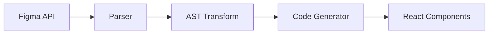

# README Guide

A README is the front door of a project. It answers "what is this, why should I care, and how do I get started?" in under two minutes of reading.

A README is a Diátaxis hybrid — part orientation (explanation), part quickstart (tutorial). Keep both halves strong.

## Sections

Sections are listed in priority order. The first three are essential; the rest depend on context.

### What it does (essential)

One to three sentences. State the problem this project solves and for whom. Don't describe the implementation — describe the value.

**Good:** "A command-line tool that converts Figma designs into production React components, preserving layout and style tokens."

**Bad:** "This project uses the Figma API and AST transformation to generate JSX from design nodes."

### Quick start (essential)

Get the reader from zero to a working result in the fewest possible steps. This should be copy-paste ready.

```bash
npm install cool-tool
npx cool-tool init
npx cool-tool generate --input design.fig
```

If prerequisites exist (runtime versions, API keys, system dependencies), state them before the commands.

### Usage (essential)

Show the most common use cases with real examples. Start with the simplest invocation, then show 2-3 variations that cover the main workflows.

### Configuration (if applicable)

Document configuration options. Use a table for flags/env vars. Link to a full reference if the config surface is large.

| Option     | Default        | Description                          |
| ---------- | -------------- | ------------------------------------ |
| `--output` | `./components` | Output directory for generated files |
| `--theme`  | `default`      | Theme preset to apply                |

### Architecture overview (if non-trivial)

Use a mermaid diagram to show how components relate. Keep it high-level — this orients the reader, it doesn't replace detailed docs.



### Contributing (if open source)

Link to CONTRIBUTING.md if it exists. Otherwise, state how to run tests, the branch strategy, and any code style expectations.

### License (if open source)

State the license and link to the LICENSE file.

## Anti-patterns to avoid

- **Feature laundry lists** — don't enumerate every feature. Show the top 3 that matter.
- **Badges as content** — a wall of badges adds noise, not value. Use sparingly.
- **"Table of Contents" for short READMEs** — if the README fits on two screens, a TOC is overhead.
- **Installation instructions for 5 package managers** — show the primary one. Link to alternatives if needed.
- **Screenshots of terminal output** — use code blocks. Screenshots can't be copied, searched, or read by screen readers.
