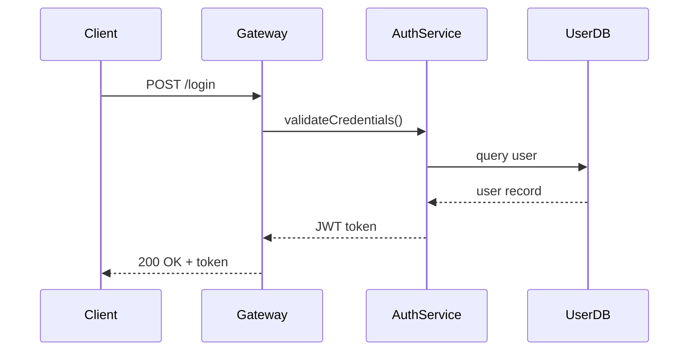

# RFC / Design Document

An RFC (Request for Comments) or design document proposes a significant change and invites structured feedback before implementation begins. Where an ADR records a decision already made, an RFC is the process of making that decision.

## When to write an RFC

- The change affects multiple teams or services
- The implementation approach isn't obvious and has trade-offs
- You want to gather feedback before investing in implementation
- The work is large enough that course-correcting mid-build would be expensive

## Sections

### Title and metadata (essential)

Include:

- **Title:** Clear, specific description of the proposal
- **Authors:** Who is proposing this
- **Status:** Draft, In Review, Accepted, Rejected, Withdrawn
- **Date:** When the RFC was created and last updated
- **Reviewers:** Who needs to approve this

### Problem statement (essential)

What problem does this proposal solve? Be specific about who is affected and what the impact is. Ground this in observable evidence — metrics, incidents, user feedback, or business requirements.

Don't jump to the solution. The reader should agree the problem is worth solving before seeing your proposal.

### Proposed solution (essential)

Describe your proposed approach in enough detail for reviewers to evaluate it. Include:

- **How it works** — the design at a level of detail appropriate to the audience
- **Data model changes** — if applicable, show schema changes or new entities
- **API changes** — if applicable, show new or modified interfaces
- **System interactions** — use mermaid diagrams to show how components communicate



### Alternatives considered (essential)

List other approaches you evaluated. For each:

- Describe the approach
- State its main advantage
- Explain why you didn't choose it

This section demonstrates thoroughness and preempts "why didn't you consider X?" feedback.

### Trade-offs and risks (essential)

Be honest about what you're giving up and what could go wrong.

- **What gets harder** as a result of this design
- **Known risks** and how you'd mitigate or detect them
- **Scaling concerns** if applicable
- **Migration complexity** if replacing an existing system

### Scope and non-goals (recommended)

Explicitly state what this RFC does *not* cover. This prevents scope creep during review and sets clear expectations.

### Rollout plan (recommended)

How is this deployed? Consider:

- **Phased rollout** — feature flags, percentage rollouts, canary deploys
- **Migration path** — how existing data/behavior transitions to the new system
- **Rollback plan** — how to revert if something goes wrong
- **Success criteria** — how you'll know the change achieved its goal

### Open questions (recommended)

List unresolved questions that need input from reviewers. Number them for easy reference in comments.

## Example skeleton

```markdown
# RFC: Migrate authentication to OAuth 2.0 + PKCE

**Author:** Alex Chen
**Status:** In Review
**Created:** 2026-03-20
**Reviewers:** Platform team, Security team

## Problem statement

Our custom session-based auth stores tokens in a way that doesn't meet the
new SOC 2 requirements flagged by the security audit (SEC-2026-014). Session
tokens are stored server-side in Redis with no rotation policy, and the auth
flow doesn't support MFA without significant rework.

## Proposed solution

Replace the custom auth middleware with OAuth 2.0 Authorization Code flow
with PKCE, delegating token management to an identity provider (Auth0).

[... detailed design with diagrams ...]

## Alternatives considered

**Patch the existing auth system:** Add token rotation and MFA to the current
implementation. Lower upfront cost, but the custom auth surface remains a
long-term maintenance burden and audit risk.

**Build OAuth in-house:** Full control, no vendor dependency. Rejected because
OAuth implementations are notoriously difficult to secure correctly, and the
team lacks specialized identity expertise.

## Trade-offs and risks

[...]

## Scope and non-goals

- **In scope:** Web app and API authentication
- **Not in scope:** Service-to-service auth (mTLS), mobile app auth flows

## Open questions

1. Do we require all existing sessions to expire on cutover, or support a
   grace period?
2. Which Auth0 plan tier meets our compliance requirements?
```

## File naming and location

Default location: `docs/rfcs/` in the repo root. Name files as `NNNN-short-description.md` (for example, `0003-oauth-migration.md`).
