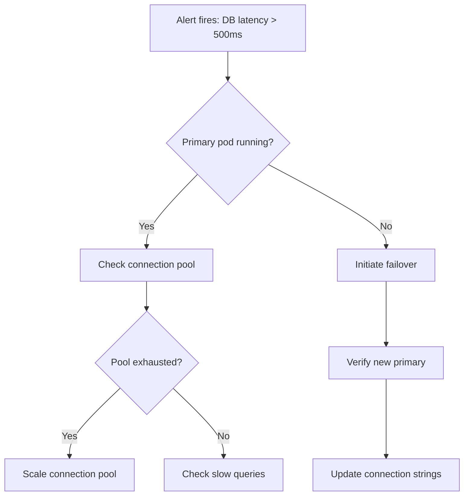

# Runbook

A runbook is a set of operational procedures for responding to specific situations — incidents, deployments, maintenance tasks, or recovery scenarios. The reader is likely under pressure and needs clear, unambiguous instructions.

## Principles

**Assume the reader is stressed.** During an incident, cognitive capacity is reduced. Every instruction must be unambiguous. No "you might want to consider" — state exactly what to do.

**Copy-paste ready.** Every command should work when pasted into a terminal. Include the full command with all flags, paths, and variables spelled out.

**Verify each step.** After every action, tell the reader what success looks like and what failure looks like. Don't let them proceed on a failed step without knowing it.

**Keep it current.** A stale runbook during an incident is dangerous. Include a "last verified" date and test runbooks regularly.

## Sections

### Title (essential)

State the scenario clearly: "Runbook: Database failover" or "Runbook: Rotate API keys".

### Metadata (essential)

| Field                  | Value                                                   |
| ---------------------- | ------------------------------------------------------- |
| **Last verified**      | Date when this runbook was last tested end-to-end       |
| **Owner**              | Team or person responsible for maintaining this runbook |
| **Estimated duration** | How long the procedure typically takes                  |
| **Impact**             | What users experience while this procedure runs         |

### When to use (essential)

Describe the symptoms or conditions that should trigger this runbook. Be specific about the signals — alert names, error messages, metrics thresholds.

### Prerequisites (essential)

What access, tools, or permissions does the operator need? List everything — don't assume.

### Steps (essential)

Numbered steps. Each step has:

1. **What to do** — a single, specific action
2. **The command** — copy-paste ready, in a code block
3. **Expected result** — what success looks like
4. **If it fails** — what to do if this step doesn't produce the expected result

Example format:

````markdown
### 1. Check current primary node

```bash
kubectl get pods -n database -l role=primary -o wide
```

**Expected:** One pod in `Running` state with `READY 1/1`.

**If it fails:** If no primary pod exists, skip to step 5 (emergency recovery).
````

### Rollback (recommended)

How to undo the procedure if something goes wrong partway through. Be specific about which steps are reversible and which create a point of no return.

### Escalation (recommended)

Who to contact if the runbook doesn't resolve the situation. Include:

- Team name and communication channel
- Specific people for critical scenarios
- What information to include when escalating

### Post-procedure (recommended)

What to do after the procedure completes:

- Verification checks to confirm the system is healthy
- Monitoring to watch for the next hour/day
- Follow-up tasks (incident report, config updates, etc.)

## Diagrams

For multi-step procedures with decision points, use a mermaid flowchart:



## Common mistakes

- **Vague commands.** "Restart the service" — which service? On which host? With which command?
- **Missing failure paths.** If a step can fail, the reader needs to know what to do next.
- **Assuming context.** The person running this runbook at 3 AM may not be the person who wrote it. Spell everything out.
- **No verification.** After the final step, always include a way to confirm the system is healthy.
